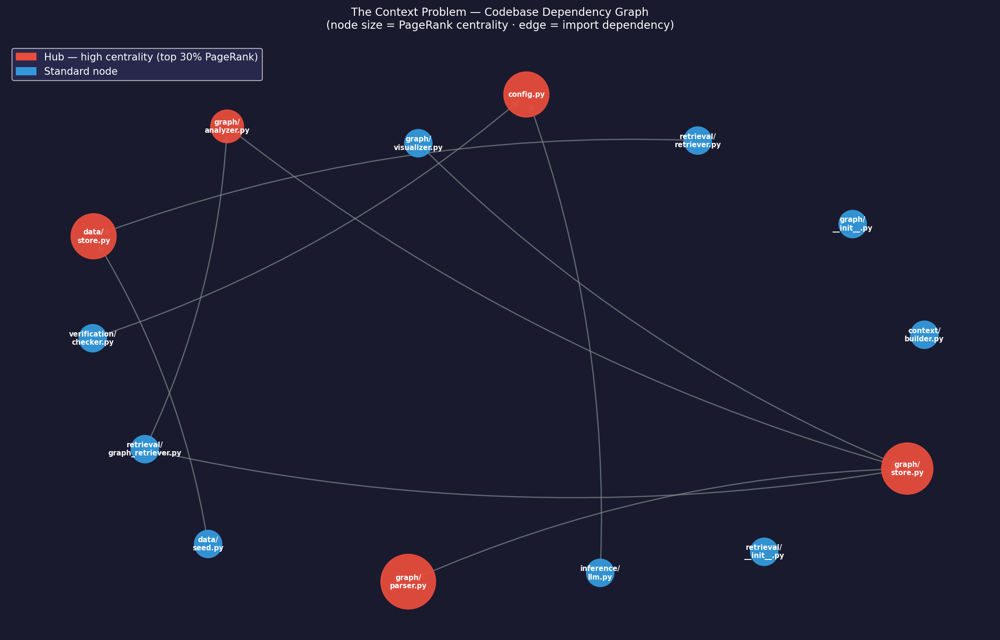

# The Context Problem

**Engineering question:** Does context quality determine model output quality?

**Hypothesis:** Yes. The model is not reasoning from ground truth — it is reasoning from a selected version of reality constructed by the system.

---

## What this is

A self-contained experiment that runs a fixed query against a fixed model using the same underlying data, varying only how that data is retrieved and assembled into a context window. Every "failure" in the results is a context failure, not a model failure — the model answered correctly given what it was shown.

**Fixed across all trials:**
- Query: *"What is the current status of INC-001 and what immediate action should be taken?"*
- Model: `claude-opus-4-6`
- Data: a 4-version incident timeline (INC-001) seeded into a versioned store

**Variable:** retrieval mode, snapshot timestamp, document ordering, token budget

---

## Setup

```bash
python3 -m venv .venv
source .venv/bin/activate
pip install -r requirements.txt
cp .env.example .env
# add your Anthropic API key to .env
python experiment.py   # Experiment 1
python experiment2.py  # Experiment 2
```

`.env` values:
```
ANTHROPIC_API_KEY=sk-ant-...
MODEL=claude-opus-4-6
TOKEN_BUDGET=600
QUALITY_THRESHOLD=0.5
```

> To reduce cost, swap `MODEL=claude-haiku-4-5-20251001` — the conclusions hold regardless of model.

---

## Project structure

```
the-context-problem/
├── experiment.py              # Experiment 1 — retrieval degradation + MVCC
├── experiment2.py             # Experiment 2 — graph-aware RAG vs flat RAG
├── config.py                  # settings (pydantic-settings + .env)
├── codebase_graph.png         # generated dependency graph visualization
├── data/
│   ├── store.py               # MVCC-style versioned document store
│   └── seed.py                # incident timeline (INC-001, runbook, service map)
├── graph/
│   ├── parser.py              # AST parser — Python files → nodes + edges
│   ├── store.py               # networkx graph store
│   ├── analyzer.py            # PageRank centrality, hub detection
│   └── visualizer.py          # dependency graph → PNG
├── retrieval/
│   ├── retriever.py           # 5 retrieval modes with configurable degradation
│   └── graph_retriever.py     # graph-aware retriever — hubs first
├── context/
│   └── builder.py             # token-budget-aware context construction (shared)
├── inference/
│   └── llm.py                 # Anthropic API wrapper (shared)
└── verification/
    └── checker.py             # quality checker + feedback trigger (shared)
```

---

## The data: INC-001 timeline

A simulated database connection pool exhaustion incident, evolving over 30 minutes.

| Version | Timestamp | Status | Severity | Recommended Action |
|---------|-----------|--------|----------|--------------------|
| 1 | T+0s | investigating | P1 | All hands on deck, escalate to VP Engineering |
| 2 | T+300s | fix_in_progress | P1 | Do not restart application servers — wait for pool reset |
| 3 | T+900s | monitoring | P2 | Hold all deploys for 15 minutes, watch error rate |
| 4 | T+1800s | resolved | P3 | Schedule post-mortem, resume normal deploy schedule |

Ground truth facts (checked against every answer): `"resolved"`, `"0%"`, `"post-mortem"` — only present in version 4.

---

## Experiment results

### Part 1 — Retrieval Degradation

Same query. Same underlying data (T+1800s — incident fully resolved). Different retrieval modes.

| Trial | Mode | Score | Pass? | Tokens | Missing facts |
|-------|------|-------|-------|--------|---------------|
| Complete context (baseline) | complete | 1.00 | YES | 455 | — |
| Stale context (10 min behind) | stale | 0.00 | NO | 493 | resolved, 0%, post-mortem |
| Incomplete context (fields cut off) | incomplete | 0.33 | NO | 224 | 0%, post-mortem |
| Noisy context (corrupted field) | noisy | 1.00 | YES | 461 | — |
| Inconsistent context (mixed replicas) | inconsistent | 1.00 | YES | 436 | — |

**What the model said when context was stale (score 0.00):**
> Severity: P2 | Status: Monitoring — error rate is dropping (currently at 8%). Recommended: Hold all deploys for 15 minutes and watch the error rate.

This was the correct answer at T+900s. The model was not wrong — the retrieval layer gave it 10-minute-old data.

**What the model said when context was incomplete (score 0.33):**
> The context does not explicitly state a current status for INC-001. Based on the available context, follow the Database Connection Pool Exhaustion Runbook to investigate.

Fields like `status`, `error_rate`, and `recommended_action` were stripped by the truncation. The model correctly reported what was missing.

**Noisy and inconsistent modes both passed** — the random corruption landed on a non-critical field, and the inconsistent replica still served INC-001 from the current snapshot. These are probabilistic failures; they would surface differently on different runs.

---

### Part 2 — MVCC Snapshot Isolation

Two requests arrive at the same wall-clock moment. Same query, same model, same code path. Only the snapshot timestamp differs.

**Request A — snapshot at T+300s (fix in progress):**
> Severity: P1 | Status: Fix in progress. Do not restart application servers yet — wait for the pool reset to complete. Next update in 10 minutes.
>
> Score: 0.00 | FAIL

**Request B — snapshot at T+1800s (resolved):**
> Severity: P3 | Status: Resolved — fully recovered, error rate at 0%. Schedule a post-mortem. Resume the normal deploy schedule.
>
> Score: 1.00 | PASS

Same model. Same query. Completely opposite answers and recommended actions — because they read different versions of reality.

> In a database, MVCC ensures readers get consistent snapshots. In an LLM system, there is no equivalent guarantee — the context construction layer is entirely responsible for temporal consistency.

---

### Part 3 — Verification + Feedback Loop

Simulates a system that detects a low-quality answer and retries with fresher context.

**Step 1 — stale context:**
> Status: Monitoring, error rate 8%. Hold all deploys for 15 minutes.
>
> Score: 0.00 — quality check FAILED (below threshold 0.5) → retry triggered

**Step 2 — retry with complete context:**
> Status: Resolved, error rate 0%. Schedule post-mortem, resume deploy schedule.
>
> Score: 1.00 — PASS

Score improved from **0.00 → 1.00 (+1.00)** after context refresh. The model and query were not changed — only the context was refreshed.

---

### Part 4 — Document Priority Under Token Budget Pressure

Token budget tightened to 350 tokens — not enough to fit all three documents. The builder uses first-fit: documents included in the order provided.

| Trial | Doc order | Included | Excluded | Score | Pass? |
|-------|-----------|----------|----------|-------|-------|
| Priority A — incident first | INC-001 → RUNBOOK → SERVICE-MAP | INC-001, SERVICE-MAP | RUNBOOK-DB-POOL | 1.00 | YES |
| Priority B — runbook first | RUNBOOK → SERVICE-MAP → INC-001 | RUNBOOK-DB-POOL | SERVICE-MAP, INC-001 | 0.00 | NO |

**What the model said when INC-001 was excluded (Priority B, score 0.00):**
> I cannot provide the current status or severity of INC-001 because that information is not present in the provided context.

The model never saw different data. Same store, same snapshot, same query. Only the insertion order changed — and it determined which document got crowded out.

> Context engineering is not just about *what* you retrieve, but also *in what order* you present it when space is constrained.

---

---

## Experiment 2 — Graph-Aware RAG vs Flat RAG

**Theme: Data Loops**

A data loop is a system where outputs are evaluated and fed back as inputs to improve the next iteration. The quality of each loop iteration depends entirely on what information enters it. This experiment asks: does graph structure help the retrieval layer feed the loop better?

**What it does:**
- Parses the codebase itself using Python AST
- Builds a dependency graph (nodes = files, edges = imports)
- Ranks files by PageRank centrality to identify architectural hubs
- Compares flat retrieval (alphabetical) vs graph retrieval (centrality-ranked) under a tight token budget
- Generates a dependency graph visualization (`codebase_graph.png`)

**Hub detection output:**
```
graph/store.py    score=0.1498   depended on by 3 files
config.py         score=0.1160   depended on by 2 files
data/store.py     score=0.1160   depended on by 2 files
```

**Results — same 450-token budget, same 8 files, same model:**

| Retrieval | `data/store.py` included? | Score | Pass? |
|-----------|--------------------------|-------|-------|
| Flat (alphabetical) | NO — crowded out by `seed.py` | 0.33 | NO |
| Graph (PageRank) | YES — ranked as hub, included second | 1.00 | YES |

**What the flat RAG model said (score 0.33):**
> *"data/store.py is the foundational component — while it is not directly included in the context..."*

It inferred the right answer from indirect clues but couldn't describe `VersionedStore`, `snapshot`, or MVCC because it never saw the file.

**What the graph RAG model said (score 1.00):**
> *"data/store.py implements a Versioned Document Store with MVCC-like snapshot isolation... every write creates a new version, a snapshot provides a consistent read view anchored at a specific timestamp... an engineer should read data/store.py first."*

**Connection to Experiment 1 — Part 4:**
Part 4 proved that insertion order determines which documents survive a tight token budget. Experiment 2 shows the principled solution: use the dependency graph to rank documents by centrality so the most architecturally important files always claim their slot first.

**The data loop path made explicit by the graph:**
```
data/store.py → retrieval/retriever.py → context/builder.py → inference/llm.py → verification/checker.py → (retry) → retrieval/retriever.py
```

Graph RAG surfaces the origin of the data loop first. Flat RAG retrieves files without knowing their role in it.

**Dependency graph visualization:**



Red nodes = architectural hubs (top 30% by PageRank) · Blue nodes = standard nodes · Node size = centrality score · Edges = import dependencies

**Reference:** [Evaluating Codebase-Oriented RAG through Knowledge Graph Analysis](https://gdotv.com/blog/codebase-rag-knowledge-graph-analysis-part-1/) — G-dot-V

---

## Key takeaways

1. **The model is only as good as its context.** Every failure above was a context failure. The model's answers were accurate given what it received.

2. **Staleness is silent.** The stale retrieval returned a full, well-formed response with no visible error — but the data was 10 minutes old and the answer was completely wrong for the actual state of the system.

3. **Snapshot time is a first-class concern.** Two concurrent requests reading different snapshots will construct different realities and recommend different actions from the same model.

4. **Retrieval degradation is not binary.** Context can fail in multiple ways — truncation, corruption, temporal inconsistency — each producing a different failure mode in the answer.

5. **Document ordering is a design decision.** Under budget pressure, the order you feed documents to the context builder determines which ones survive. Ranking is part of context engineering.

6. **Self-correction is possible without changing the model.** The feedback loop in Part 3 recovered a 0.00 score to 1.00 purely by retrying with better context.

7. **Graph structure solves the ordering problem.** PageRank centrality provides a principled ranking signal — architectural hubs surface first, ensuring the model always sees the most foundational components before the budget runs out.

8. **Data loops need graph-aware retrieval.** If your retrieval layer doesn't understand the structure of your data, it will consistently feed the loop the wrong context. The loop iterates — but on the wrong foundation.
